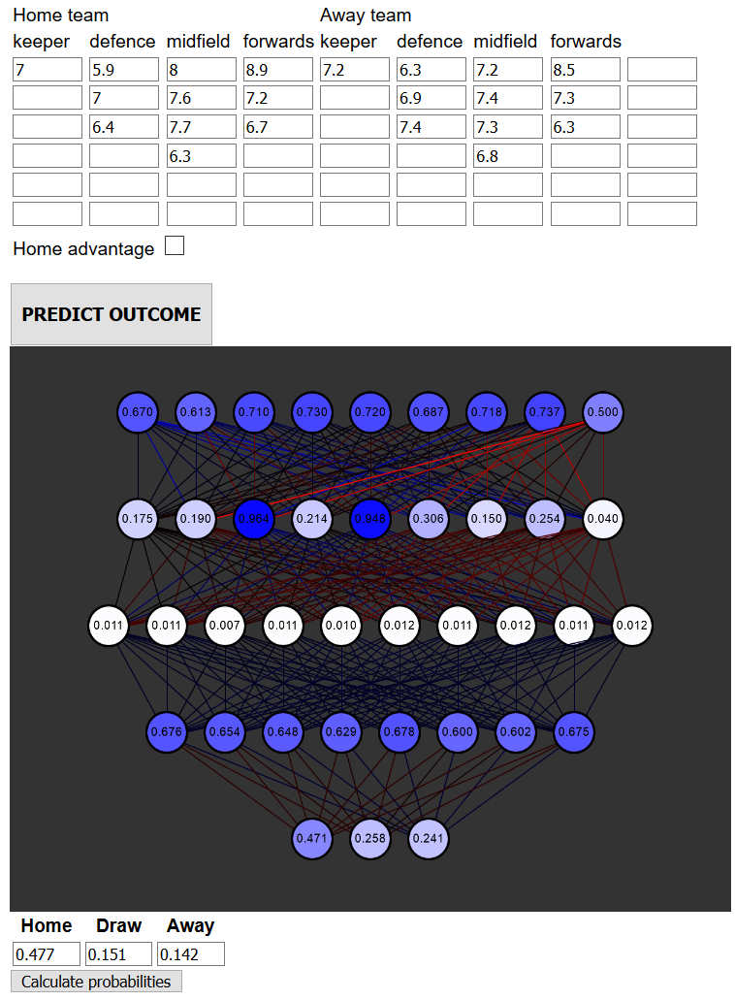

# neural-net-football

I programmed a feedforward neural network in Javascript to (attempt to) predict the outcome of football (soccer) matches.
My code simply takes care of the feedforward steps using a predefined list of weigths for the synapses. After these steps, the predicted winner is displayed in a p5.js sketch.
NB: the backpropagation was performed using Simbrain.

## demo
Navigating to index.html provides the user with something that looks like this:

We can change the home and away teams' individual player's ratings (0-10) using the table of input fields.
We then average and normalise these ratings, after which the predicted result is shown in the p5.js sketch.
NB: optionally, you can set "home advantage" to either true or false.
